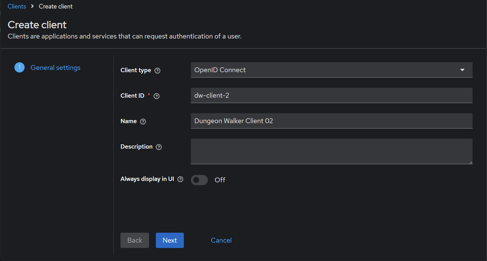
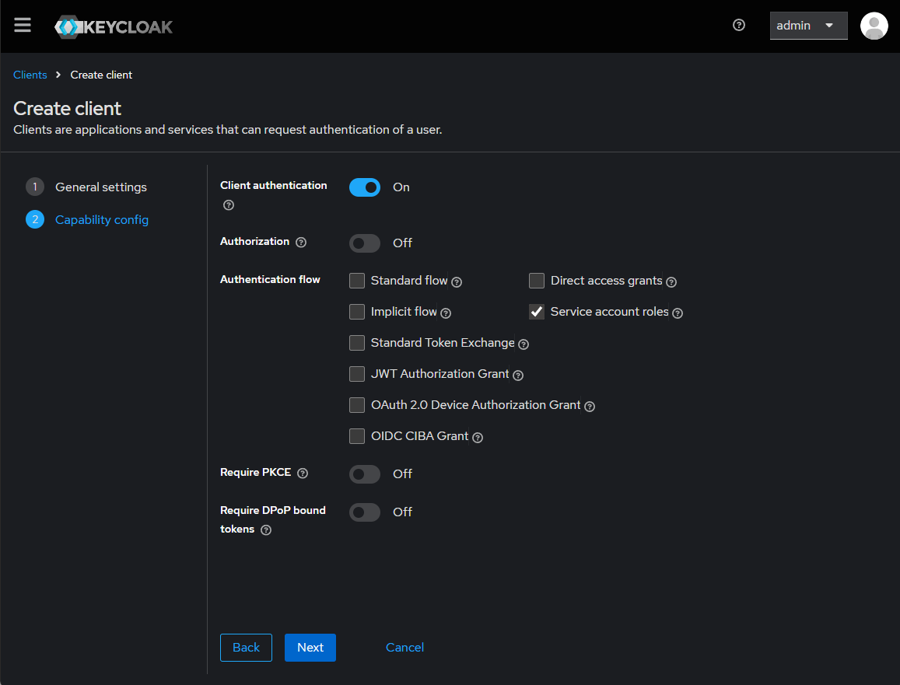
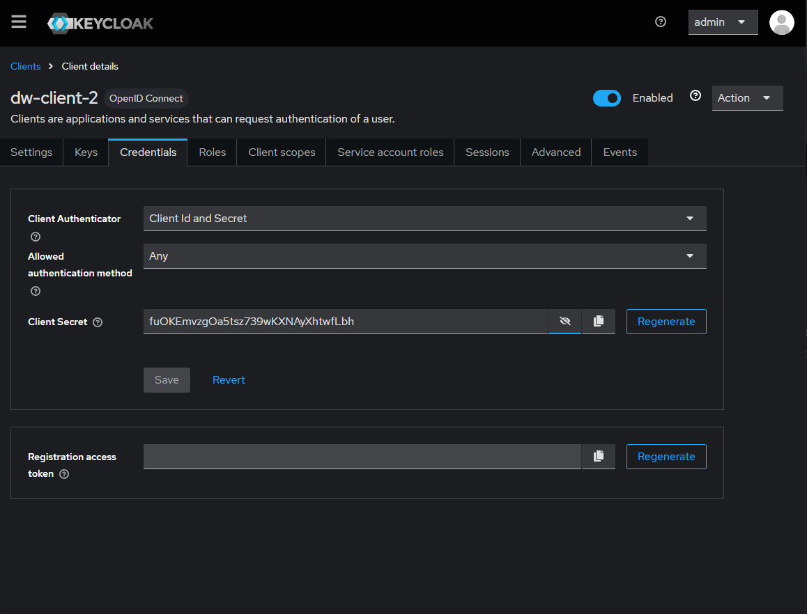
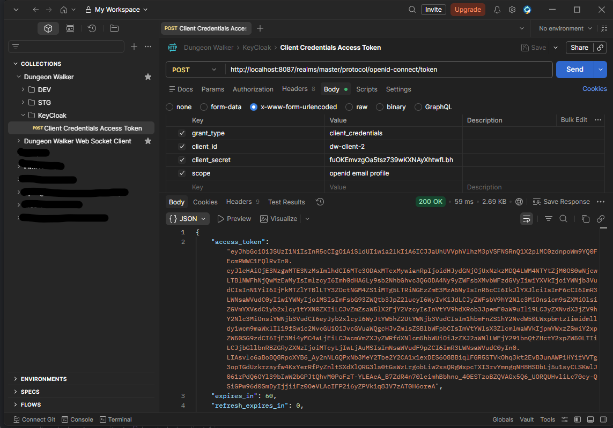

# Container Environments for Dungeon Walker

<!-- TOC -->
* [Container Environments for Dungeon Walker](#container-environments-for-dungeon-walker)
  * [Kafka](#kafka)
    * [Using IJ's Kafka Plugin](#using-ijs-kafka-plugin)
      * [IJ's Kafka Plugin Producer](#ijs-kafka-plugin-producer)
      * [IJ's Kafka Plugin Consumer](#ijs-kafka-plugin-consumer)
  * [PostgreSQL](#postgresql)
  * [Grafana](#grafana)
  * [Keycloack](#keycloack)
    * [Application AUthorization Flow](#application-authorization-flow)
      * [1) Create a client, 1rst step](#1-create-a-client-1rst-step)
      * [2) Create a client, 2nd step](#2-create-a-client-2nd-step)
      * [3) Create a client, 3rd step](#3-create-a-client-3rd-step)
      * [4) Request the token](#4-request-the-token)
    * [Authorization Code Grant Type Flow](#authorization-code-grant-type-flow)
      * [1) Extend session timeout](#1-extend-session-timeout)
      * [2) Create the client](#2-create-the-client)
      * [3) Check client's secret](#3-check-clients-secret)
      * [4) Create the user](#4-create-the-user)
<!-- TOC -->

## Kafka

If you run [build-n-run-service-images.sh](build-n-run-all-services.sh) to start the containers, no topic creation
may be needed. If not, after the container has started, run the following command:

```shell
docker exec -i kafka opt/kafka/bin/kafka-topics.sh \
--create \
--if-not-exists \
--bootstrap-server kafka:29092 \
--replication-factor 1 \
--partitions 1 \
--topic game-engine-consumer-topic
```

### Using IJ's Kafka Plugin

1. `View -> Tool Windows -> Kafka`
2. `+` (New Connection)
3. Configuration source: `Custo`
4. Bootstrap servers: `127.0.0.1:9092`
5. Authentication: `None`
6. Schema Registry (Optional):
    - Type:`None`

#### IJ's Kafka Plugin Producer

- Topic: `game-engine-consumer-topic`
- Key:
    - Type: `String`
    - Value: `user-id`
- Value:
    - Type: `Protobuf (Custom)`
    - Schema: `Explicit`

```protobuf
syntax = "proto3";

package contract.client;

message ClientRequest {
  string client_id = 1;
  oneof data {
    Connection connection = 2;
    Movement movement = 3;
  }
}

message Connection {}

message Movement {
  Direction direction = 1;
}

enum Direction {
  N = 0;
  E = 1;
  S = 2;
  W = 3;
  NE = 4;
  SE = 5;
  SW = 6;
  NW = 7;
}
```

- Payloads:

```json
{
  "client_id": "user-id",
  "connection": {}
}
```

```json
{
  "client_id": "user-id",
  "movement": {
    "direction": "E"
  }
}
```

#### IJ's Kafka Plugin Consumer

- Topic: `game-engine-consumer-topic`
- Key:
    - Type: `String`
- Value:
    - Type: `Protobuf (Custom)`
    - Schema: `Explicit`

```protobuf
syntax = "proto3";

package contract.client;

message ClientRequest {
  string client_id = 1;
  oneof data {
    Connection connection = 2;
    Movement movement = 3;
  }
}

message Connection {}

message Movement {
  Direction direction = 1;
}

enum Direction {
  N = 0;
  E = 1;
  S = 2;
  W = 3;
  NE = 4;
  SE = 5;
  SW = 6;
  NW = 7;
}
```

- Range and Filters
    - Start from: Latests
    - Limit: None
    - Filter: None

## PostgreSQL

The schema in the [create_tables_postgres.sql](ddl-scripts/create_tables_postgres.sql) file should be run when the
PostgreSQL container is started for the first time. If for some reason the schema is not created, run the following
command in the `dungeon-walker-docker` root folder:

```shell
docker exec -i postgres-db psql -U postgres -t < ddl-scripts/create_tables_postgres.sql
```

## Grafana

The whole development Grafana container configuration is based on the official Grafana Loki documentation. Check: 
[Grafana Loki - Quick strat](https://grafana.com/docs/loki/latest/get-started/quick-start/quick-start/)

From there it will be able to download:
```shell
wget https://raw.githubusercontent.com/grafana/loki/main/examples/getting-started/loki-config.yaml -O loki-config.yaml
wget https://raw.githubusercontent.com/grafana/loki/main/examples/getting-started/alloy-local-config.yaml -O alloy-local-config.yaml
wget https://raw.githubusercontent.com/grafana/loki/main/examples/getting-started/docker-compose.yaml -O docker-compose.yaml
```

The first two files are [grafana/loki-config.yaml](observability/loki-config.yaml) and 
[grafana/alloy-local-config.yaml](observability/alloy-local-config.yaml). The third file was copied to the root folder as 
[docker-compose-grafana.yml](docker-compose-observability.yml).

All files were adapted to the `dungeon-walker-docker` environment and naming conventions.

## Keycloack

- Username: admin
- Password: admin

### Application AUthorization Flow

#### 1) Create a client, 1rst step



#### 2) Create a client, 2nd step



#### 3) Create a client, 3rd step



#### 4) Request the token



### Authorization Code Grant Type Flow

#### 1) Extend session timeout
 
- Realm settings:
  - Sessions:
    - SSO Session Settings
      - SSO Session Idle: 30 minutes
      - SSO Session Max: 10 hours
    - Client session settings
      - Client Session Idle: 30 minutes
      - Client Session Max: 10 hours
    - Offline session settings
      - Offline Session Idle: 30 Days
      - Client Offline Session Idle: 10 Hours
      - Offline Session Max Limited: Disabled
    - Login settings:
      - Login Timeout: 30 minutes
      - Login action timeout: 10 hours
  - Tokens:
    - General:
      - OAuth 2.0 Device Code Lifespan: 1 Hour
      - Lifetime of the Request URI for Pushed Authorization Request: 1 Hour
    - Access tokens
      - Access token lifespan: 30 minutes
      - Access token lifespan for implicit flow: 1 Hour
      - Client Login Timeout: 1 Hour


#### 2) Create the client

- Clients:
  - Create Client: 
    - Generale Settings:
      - Client type: OpenID Connect 
      - Client ID: auth-code-grant-type-flow
      - Name: Authorization Code Grant Type Flow
    - Capability config:
      - Client authentication: ON
      - Authenticated flow:
        - Standard flow: YES
        - ... All others: NO
    - Login settings:
      - Valid Redirect URIs: * (since we don't have a UI for now)
      - Web origins: * (for now accept request from cross-domains)
      - ... All others: <empty>
    - Save

#### 3) Check client's secret

- Clients:
  - auth-code-grant-type-flow:
    - Credentials:
      - Client secret: Q3QTk5FQybkXHsqEJvTesNaQOyFnL8iF

#### 4) Create the user

- Users:
  - Add User:
    - Email verified: ON
    - Username: user1
    - Email: user1@momomomo.com
    - Create
  - Credentials:
    - Set password:
      - Password: password1
      - Temporary: OFF
      - Save

#### Postman


