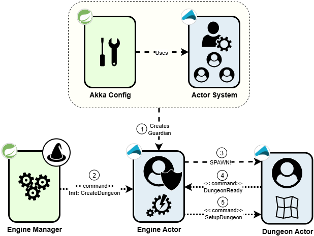
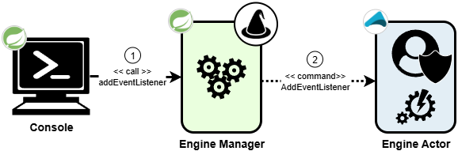
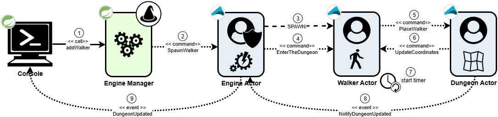
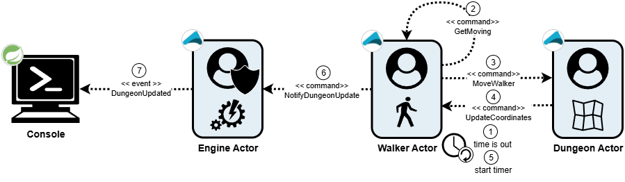

# Dungeon Walker

A dungeon game engine to help me study Pekko (a fork of Akka), Kafka and other technologies.

### Loading the map and creating the dungeon

### Allowing interactions with the dungeon engine

### Creating an automated dungeon walker

### Dungeon walker movements

