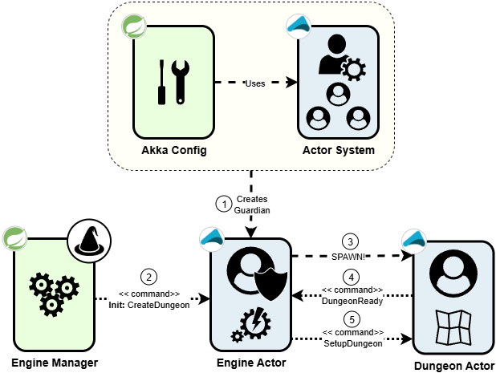
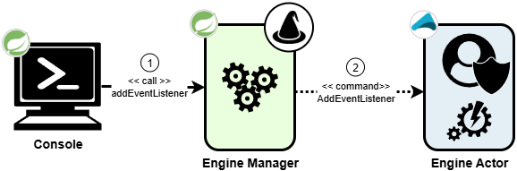
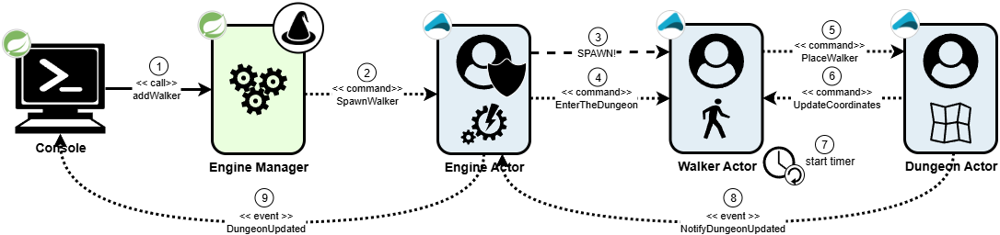
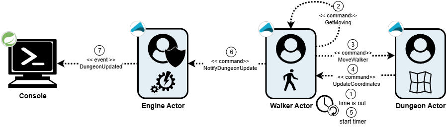

# Dungeon Walker Engine

`dungeon-walker-engine` is the authoritative, stateful game service for Dungeon Walker. It is a Spring Boot application
built to explore Apache Pekko (a fork of Akka), Kafka, RabbitMQ, and durable actor state.

It loads dungeon maps, creates cluster-sharded actors for dungeons and players, accepts Protobuf client requests through
Kafka, applies placement and movement rules, persists game state with Pekko R2DBC, and publishes targeted updates to
clients.

## Modules

| Module             | Role                                                                                          |
|--------------------|-----------------------------------------------------------------------------------------------|
| `engine-domain`    | Dungeon, cell, wall, coordinates, walker state, movement, and placement models.               |
| `engine-core`      | Pekko actors, cluster sharding, map loading, client-command mapping, and actor configuration. |
| `engine-transport` | Kafka consumer/producer adapters and RabbitMQ history-log publisher.                          |
| `engine-startup`   | Spring Boot entry point, scheduling, integration tests, and container setup.                  |

## Architecture

The engine uses two durable, cluster-sharded entity types:

- A `DungeonActor` owns one dungeon's map, cell occupancy, player placement, movement, and periodic dungeon heartbeat.
- A `WalkerActor` owns one player's state and position. It subscribes to dungeon broadcasts, then turns those updates
  into client-targeted messages.

Dungeon and walker state are persisted with the Pekko R2DBC durable-state plugin. Pekko Artery provides cluster
communication; a Split Brain Resolver is configured for cluster downing.

### Loading the map and creating the dungeon

At startup, `DungeonSetup` finds `dungeons/*.dgn` resources and parses them into dungeon entities. The bundled
`LVL-001.dgn` map is a 10-by-10 grid with boundary and internal walls plus a default spawn location. Existing persisted
levels are retained; otherwise, the appropriate `DungeonActor` receives a `SetupDungeon` command.



### Client interaction flow

Client interaction is message-driven:

1. The Kafka consumer receives a Protobuf `ClientRequest`.
2. `ClientMessageManager` selects a mapper and routes the resulting command to the walker entity identified by the
   request's client ID.
3. The walker and dungeon actors exchange commands through cluster sharding.
4. Walker actors publish targeted Protobuf `EngineMessage` updates through the outbound Kafka topic.

Supported client requests map to `WakeUp` (enter dungeon), `Move`, `Leave`, and `UserHeartbeat` commands.



### Entering the dungeon

An entering walker transitions from `Asleep` to `Awake` and asks the level-one dungeon to place it. The dungeon uses
`SpiralStrategy`, which searches outward from the default spawn location for an available cell. Once placed, the walker
receives the full dungeon state and transitions to `Stopped`.



### Moving through the dungeon

A movement request transitions the walker to `Moving` and asks the dungeon to move it one cell in the requested
direction. The dungeon accepts only free candidate cells. A successful move persists the new dungeon state and
broadcasts a cell update; an unavailable destination makes the requesting walker stop. All subscribed walkers receive
the resulting cell updates, but each generated outbound message identifies its intended player.



## Messaging

| Direction | Transport                        | Payload         | Purpose                                                                                    |
|-----------|----------------------------------|-----------------|--------------------------------------------------------------------------------------------|
| Inbound   | Kafka                            | `ClientRequest` | Delivers player commands to the engine.                                                    |
| Outbound  | Kafka                            | `EngineMessage` | Delivers targeted dungeon state, cell state, heartbeat, error, and informational messages. |
| Outbound  | RabbitMQ via Spring Cloud Stream | `HistoryLog`    | Records a successful player's placement coordinates.                                       |

The dungeon broadcasts internal state changes using a Pekko pub/sub topic. Every walker actor subscribes to it; the
target on each emitted `EngineMessage` allows downstream services to route updates to the corresponding user connection.

## Configuration and operation

The application imports configuration from the config server by default:

```text
http://localhost:8083
```

`APP_PROFILE` selects the active Spring profile. Pekko R2DBC connection, Pekko remote/cluster, Kafka, topic, and
heartbeat settings are supplied through configuration. The container exposes port `8081`; gameplay itself is handled
through Kafka, while Spring Boot Actuator is the primary HTTP operational surface.

`DisplayDungeonState` can be enabled with `dungeonwalker.engine.schedule.display-dungeon-state.enabled=true` to log the
persisted level-one map every second.

## Tests

The Cucumber integration scenario in `engine-startup` verifies a player entering, moving, concurrent player updates,
leaving, re-entering, and recipient-specific dungeon/cell-state responses.

Run it from the startup module:

```bash
cd engine-startup
mvn test
```

## Current implementation notes

- User heartbeat commands are accepted but do not currently influence player liveness or timeout behavior. Dungeon
  heartbeats are outbound notifications.
- Kafka inbound records are acknowledged after being routed to an actor, rather than after persistence and client
  delivery. Outbound Kafka send failures are logged but are not retried by application code.
- The dungeon's enclosing wall layout normally keeps moves in bounds; the domain movement operation assumes supplied
  candidate cells exist rather than explicitly validating coordinates.
