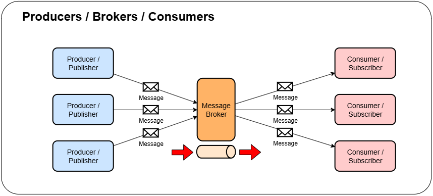
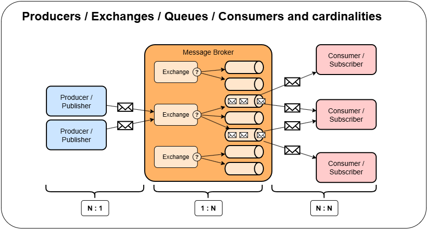
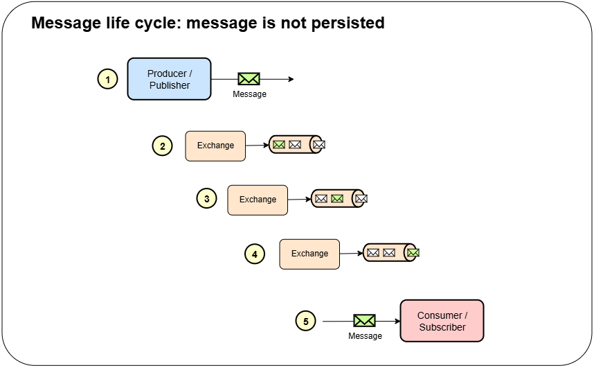
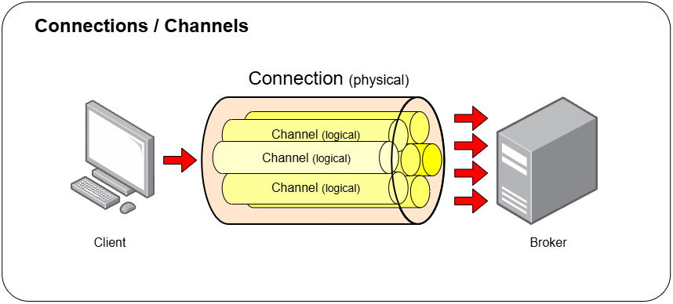

# Dungeon Walker - History Service

Saves the dungeon changes to a database and allows for retrieval of past dungeon states. With this it is possible to see
how the whole dungeon, or even individual walkers, have changed over time.

## Technologies

### RabbitMQ

The engine service must send asynchronous messages to the history service every time a change is made to the dungeon.
This message will be sent using AMQP (Advanced Message Queuing Protocol), supported
by [RabbitMQ](https://www.rabbitmq.com/).

### Spring Functions

Summary: Use Java functional interfaces as spring beans (ex: Function, Consumer, Supplier).

### Spring Cloud Stream

Summary: Event-driven abstraction layer that promises messaging middleware independence. Natively support RabbitMQ,
Apache Kafka, among others and allegedly Google PubSub maintained by partners. The idea is to simply add the right
dependencies in the `pom-xml` and correctly config the middleware in the `application.yml`.

#### Core Concepts

- Destination binders: components that integrate with the external messaging system. It's Spring's infrastructure
  components that seamless integrates with the messaging system, establishing communication channels that serve as
  connections between the application and the broker.
- Destination bindings: components that will **produce** and **consume** messages from the external messaging system.
- Messages: the data that is sent and received from the external messaging system.