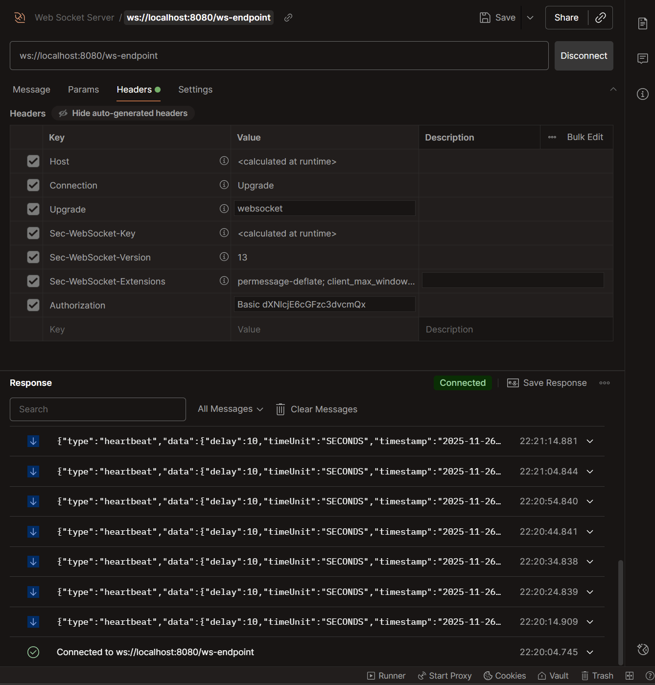
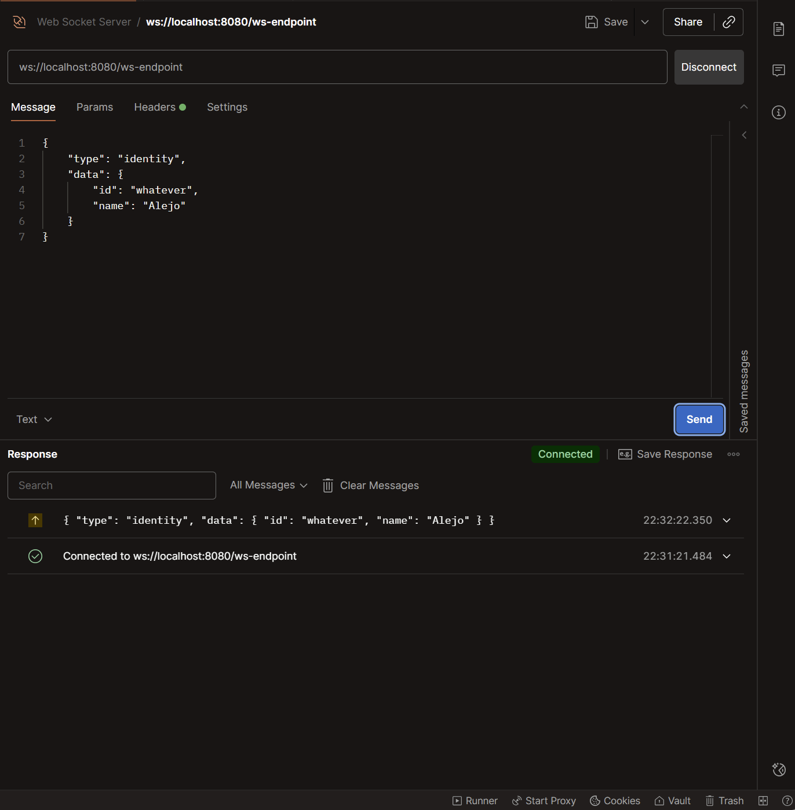

# Dungeon Walker WebSockets Server

To be defined...

## Using Postman

How to connect to the WebSocket Server using Postman?

For basic authorization (user/password), you can do the following:

1. Create a new WebSocket request: File / New / WebSocket
2. Add your URL with "ws" or "wss" protocol, ex: "ws://localhost:8080/ws-endpoint"
3. Assuming your user is "user1" and your password is "password1":
    1. Encode to Base64 the string "user1:password1" (you can use a site like www.base64encode.org)
    2. Concatenate the result to "Basic" string, for example: "Basic dXNlcjE6cGFzc3dvcmQx"
    3. Add an "Authorization" header to your WebSocket request with this value.
4. Click the "Connect" button
5. On the "Message" tab, click on "Send" to send a message

